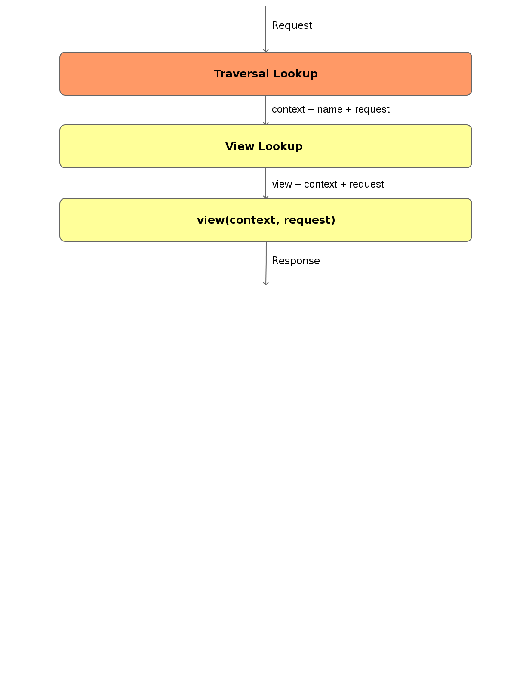

.. Grimper en haut de la Pyramid slides file, created by
   hieroglyph-quickstart on Mon Oct 20 10:59:33 2014.

Grimper en haut de la Pyramid
=============================

Gaston Tjebbes

gaston@majerti.fr

.. image:: _static/pyramid_guat.png

Le choix du framework
======================

* La reprise d'un projet existant

* Peu de budget au départ

* Un nouveau projet avec des ambitions à long terme

.. slide::

    .. image:: _static/pyramid.png
        :width: 70%
        :align: center

Premier pas
============

.. code-block:: console

    $ mkvirtualenv pyramid_test
    $ pip install pyramid
    $ pcreate -s starter myproject
    $ cd myproject
    $ python setup.py develop
    $ pserve development.ini
    Starting server in PID 3248.
    serving on http://0.0.0.0:6543

Eh mais en fait, c'est du Python !!!

.. note::

    Ici on utilise le scaffold starter (on peut créer les siens), qui fournit un
    projet avec une structure prédéfinie et notamment nous fournit un package
    python pip installable.

.. nextslide::

.. code-block:: console

    $ tree
    ├── CHANGES.txt
    ├── development.ini
    ├── MANIFEST.in
    ├── myproject
    │   ├── __init__.py
    │   ├── static
    │   │   ├── pyramid-16x16.png
    │   │   ├── pyramid.png
    │   │   ├── theme.css
    │   │   └── theme.min.css
    │   ├── templates
    │   │   └── mytemplate.pt
    │   ├── tests.py
    │   ├── views.py
    ├── production.ini
    ├── README.txt
    └── setup.py

Le minimum nécessaire
=====================

**Request => Code => Response**

.. code-block:: python

    def main(global_config, **settings):
        config = Configurator(settings=settings)
        config.include('pyramid_chameleon')
        config.add_static_view('static', 'static', cache_max_age=3600)
        config.add_route('home', '/')
        config.scan()
        return config.make_wsgi_app()

.. code-block:: python

    @view_config(route_name='home', renderer='templates/mytemplate.pt')
    def my_view(request):
        return {'project': 'myproject'}

Le view lookup
===============

.. code-block:: python

    @view_config(route_name='home', renderer='json', xhr=True)
    @view_config(route_name='home', renderer='templates/mytemplate.pt')
    def my_view(request):
        return {'project': 'myproject'}

.. code-block:: console

    $ wget -q -O - "$@"  http://127.0.0.1:6543/
    $ wget --header="X-Requested-With:XMLHttpRequest" -q -O - "$@" \
    http://127.0.0.1:6543/

Les vues, des objets Python
============================

Ce sont :

* Des fonctions
* Des classes
* Des méthodes de classe

Une seule contrainte dans les cas (2) et (3) :

.. code-block:: python

    def __init__(self, request):
        self.my_request_object = request

Extensible
==========

Un moteur de templating ? Nous vous proposons :

* pyramid_chameleon
* **pyramid_mako**
* pyramid_jinja2

.. code-block:: console

    pip install pyramid_mako

.. code-block:: python

    config.include('pyramid_mako')

.. code-block:: python

    @view_config(route_name='home', renderer='templates/home.mako')

.. nextslide::

Le système d'include de Pyramid et l'ajout de directive au Configurator vont
permettre de créer facilement des extensions.

Sans-opinion
=============

Pyramid tente de vous laisser libre :

* Dans la définition de la structure de votre application
* Dans le choix de vos outils (templating, persistence des données, formulaire ...)

Ce qui vous rend autonome dans vos choix, et permet d'adapter votre outil à
votre besoin, et pas l'inverse.
Cependant, ces nombreuses possibilités peuvent être un frein, surtout pour un
débutant.

.. note::

    Je le déconseille aux débutants pressés
    Le développement initial d'une application peut être long (plus long qu'avec
    des outils plus structurants), néanmoins ce temps est largement compensé par
    le fait que votre code est structuré pour votre besoin.

URL Dispatch
============

.. image:: _static/dispatch.png

URL Traversal
==============

URL Traversal : l'arbre
------------------------

.. nextslide::

Une directive de configuration pour définir la racine de l'arbre.

.. code-block:: python

    class User(dict):
        pass

    class UserQueryFactory(object):
        def __getitem__(self, id):
            return User(
                id=id,
                name=u"Fraichement récupéré dans la base de données"
            )

    class MyRootFactory(dict):
        def __init__(self, request):
            self.request = request
            self['users'] = UserQueryFactory()

    config.set_root_factory(MyRootFactory)

.. note::

    UserQueryFactory implémente une méthode __getitem__ (comme le dictionnaire
    MyRootFactory).

URL Traversal : les vues
-------------------------

Les vues sont désormais rattachées à un type de contexte et éventuellement à un nom.

.. code-block:: python

    def json_view(context, request):
        return {'user': context}

    config.add_view(json_view, context=User, name='json',
                    renderer='json')

.. code-block:: console

    $ wget -q -O - "$@"  http://127.0.0.1:8080/users/15/json/dontcare
    {"user": {"name": "Fraichement récupéré dans la base de données", "id":
    "15"}}

* MyRootFactory(request)[**users**][**15**] => My *User*
* My *User* + "**json**" => json_view callable

.. note::

    Le traversal lookup a parcouru l'arbre de traversal avec les segments de l'url
    **/users/15/json/dontcare**, il nous a renvoyé une ressource User et un nom
    "json".

One Page App en Pyramid
========================

Une seule page html, plein de js et une Api Rest

* Générer une Api Rest avec Cornice : `http://cornice.readthedocs.org/en/latest/`
* MVC côté client avec Backbone-Marionette

Application SQL classique
==========================

* SQLAlchemy : l'ORM
* alembic : la migration de base de données
* sqlautocode : générer les schémas depuis une base existante
* pyramid_deform (deform/colander) : formulaires
* pyramid_layout
* colanderalchemy : générer des schémas colander depuis des modèles SQLAlchemy

.. slide::

    .. figure:: _static/pyramid_top.png
        :class: fill

Merci
======

?
